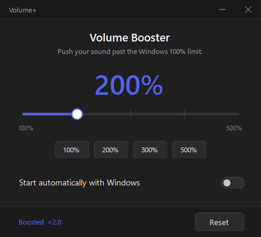

# Volume+

**Turn your volume up past 100% — all the way to 500%.**

Volume+ is a tiny Windows app that lives in your system tray. Windows caps the volume
slider at 100%; Volume+ gives you a second slider that goes **100% → 500%**, so quiet
videos, calls and games can actually get **loud**.

---

## ✨ Features

- 🔊 **Volume 100% → 500%** — push your sound past the Windows limit with one slider.
- ⚡ **One-click presets** — 100 / 200 / 300 / 500%.
- 📌 **Lives in the system tray** — double-click to open, quiet and out of the way.
- 🚀 **Starts automatically with Windows** (optional, one click).
- 🔒 **No account, no login, no telemetry.** 100% local.

## ✅ Requirements (read this first)

Volume+ needs **[Equalizer APO](https://sourceforge.net/projects/equalizerapo/)** — a free,
open-source Windows audio engine — to actually amplify the sound.

**Why?** Windows' 100% isn't a lockable limit you can just raise: the volume slider only
*attenuates*, and the audio engine (`audiodg.exe`) is a protected process nothing can
inject into. The **only** native way to go above 100% is a system audio effect (an APO).
Volume+ drives Equalizer APO's engine for you — you never have to touch it.

> On first launch, if Equalizer APO isn't installed, Volume+ shows a **"Get Equalizer APO"**
> button. Install it, pick your output device, reboot once — then Volume+ takes over.

## 🚀 Install

1. Install **[Equalizer APO](https://sourceforge.net/projects/equalizerapo/)** (free), tick
   your speakers/headset during setup, and reboot once.
2. Download `VolumePlus.exe` from the [Releases](../../releases) page.
3. Double-click it. That's it — no installation.
   *(Windows SmartScreen may warn because the exe isn't code-signed →
   "More info" → "Run anyway".)*

## 🛡️ Is it safe?

- **[Scan it yourself on VirusTotal](https://www.virustotal.com/gui/search/a13a61aad869a3eea2e797efd0d72ad69ed59490e9a5c28dfd58fdd9cf35293b)** — VirusTotal indexes by file hash, so the link always shows the current result for this exact `.exe`.
- **No account, no telemetry, no network calls** — Volume+ only writes a small local config file that tells Equalizer APO how loud to go.
- **Single-purpose** — one small tool that does exactly one thing.

The exe isn't code-signed (signing certificates cost money), so **Windows SmartScreen may
warn you** the first time — that's normal for indie apps. Click "More info" → "Run anyway".

## ⚙️ How it works

The Windows volume slider is an **attenuator**: 100% means "signal untouched", and there's
nothing above it — the endpoint volume API is capped at 1.0, and the audio engine
(`audiodg.exe`) is a protected process no tool can inject into. The **one** native place to
add gain is the **APO** (Audio Processing Object) chain — the same slot sound-card makers
use for their effects.

Volume+ simply sets Equalizer APO's **preamp** in real time: dragging the slider to `N%`
applies a gain of `20 · log10(N / 100)` dB (200% = +6 dB, 500% ≈ +14 dB), live.

> ⚠️ Digital gain has no free headroom: at very high settings, already-loud content can
> clip/distort. Turn Windows' own volume down before you put your headphones on, then bring
> it up gradually.

## 📁 Config

Your setting is stored in `%AppData%\VolumePlus\config.json`.

## 📄 License

**Proprietary — © 2026 Veax. All rights reserved.**

Volume+ is **free to download and use**. You may not copy, modify, redistribute,
sell, or reverse-engineer it. See [LICENSE](LICENSE) for details.
